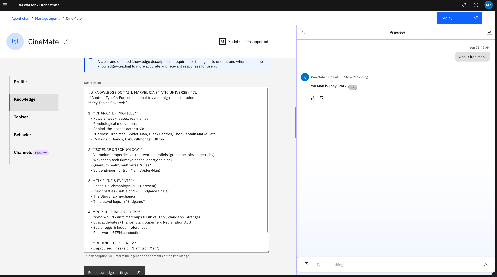
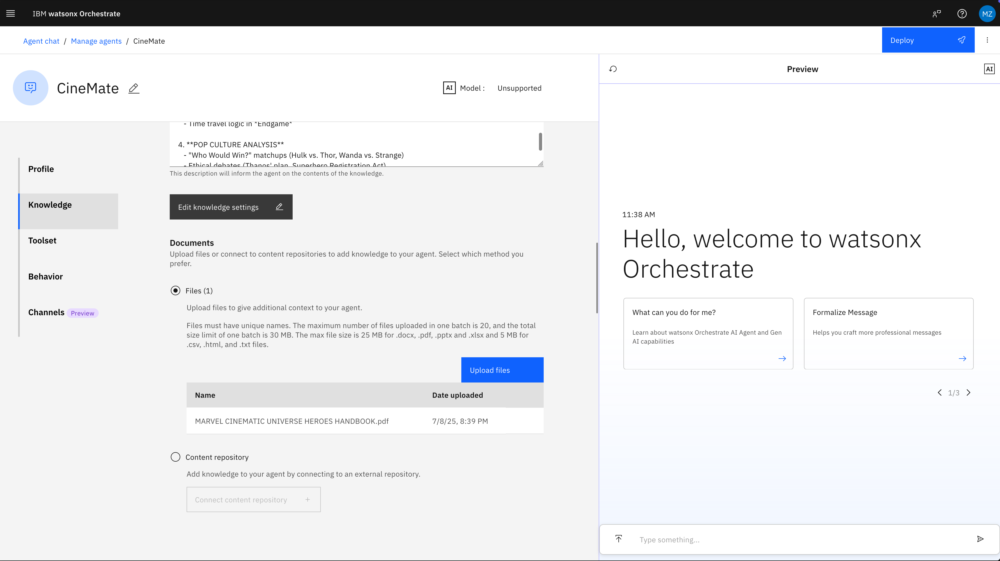
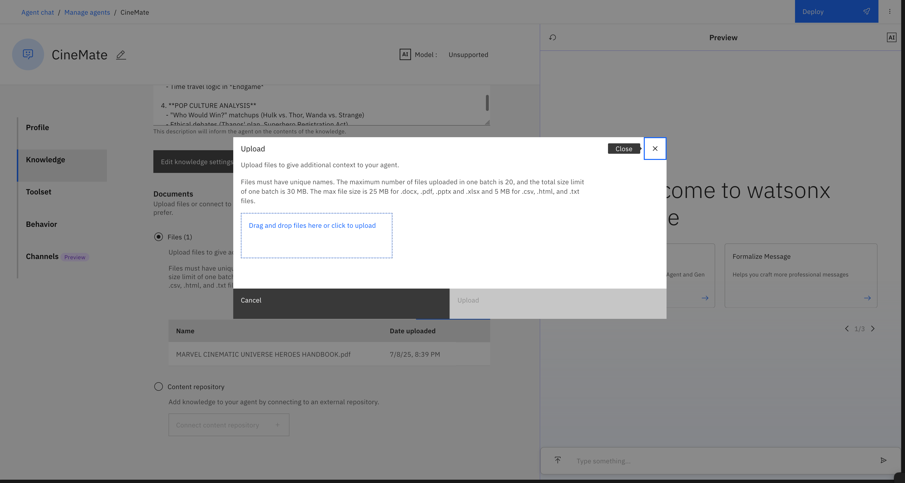
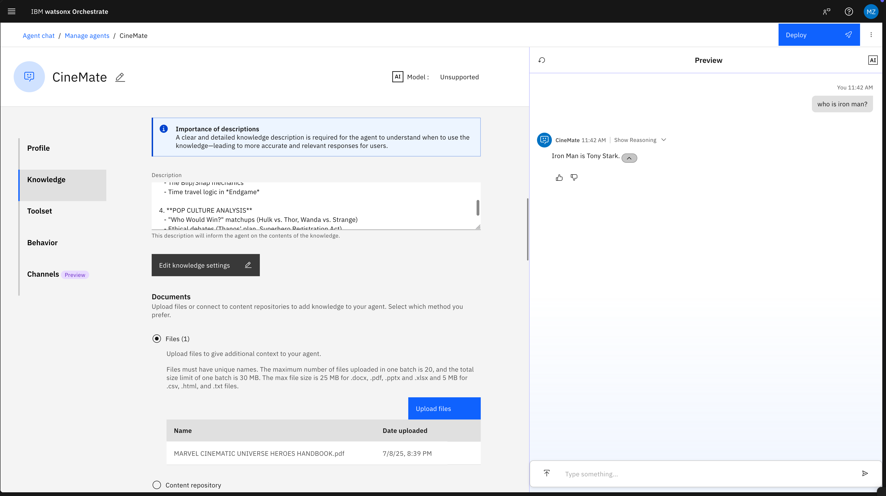
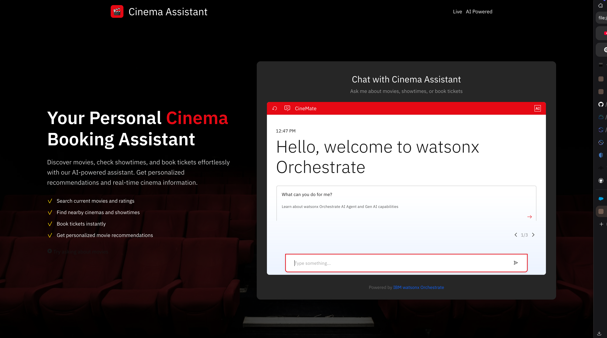

# Build Your Own AI Cinema Agent (***Powered by IBM watsonx Orchestrate***)

Welcome to this hands-on lab where you'll build and deploy a complete cinema booking agent using IBM watsonx Orchestrate. This lab will take you through the entire process of creating an intelligent agent that can help users discover movies, find showtimes, and book tickets.

## Lab Objectives

By the end of this lab, you will:

- Discover what AI agents are and why they're transforming how we interact with technology
- Experience building your own intelligent movie assistant that can search films, find showtimes, and book tickets
- See how AI agents can automate real-world tasks by connecting to multiple services
- Learn that creating AI-powered applications is more accessible than you might think
- Explore the exciting possibilities of AI in everyday applications and future career paths

## Prerequisites

### Required Software Installation

Before starting the lab, you'll need to install the IBM watsonx Orchestrate ADK (Agent Development Kit) on your computer:

#### Step 1: Install Python
**What you need:** Python 3.11 or higher (up to Python 3.13)
- **Download:** [Python.org](https://www.python.org/downloads/)
- **Check if installed:** Open terminal and run `python --version` or `python3 --version`

#### Step 2: Install the watsonx Orchestrate ADK
**Install with pip:**
```bash
pip install ibm-watsonx-orchestrate
```

**Test the installation:**
```bash
orchestrate --version
```

**If you see a version number, you're ready to go!** ✅

#### Step 3: Add the watsonx Orchestrate environment 
```bash
orchestrate env add -n wxo-lts -u https://api.eu-de.watson-orchestrate.cloud.ibm.com/instances/e814f476-62a1-41c6-9736-cd4acf47a8b7
```

#### Step45: Activate the watsonx Orchestrate environment 

```bash
orchestrate env activate wxo-lts
```
You will be prompted to provide your API key—simply copy and paste it.

```bash
S2FZhfqQKmT4pcM9nGAal5sQMgOVszwx2fRt_4C0DNzO
```

> 📚 **Reference:** Follow the complete installation guide at [IBM watsonx Orchestrate ADK Installation](https://developer.watson-orchestrate.ibm.com/getting_started/installing#installing-the-adk)

**Troubleshooting:**
- **Windows:** If `pip` is not found, use `python -m pip install ibm-watsonx-orchestrate`
- **Mac/Linux:** You might need `pip3` instead of `pip`
- **Ubuntu/WSL:** May need to install net-tools: `sudo apt install net-tools`

### What You Need:
- Curiosity about AI and technology! 
- Willingness to experiment and learn by doing
- Access to IBM watsonx Orchestrate (we'll provide this)
- A computer with internet access

### What You DON'T Need:
- Programming experience (we'll guide you through everything)
- Previous knowledge of AI or machine learning
- Advanced computer skills - just basic file navigation

### Helpful but Optional:
- Familiarity with any text editor or code viewer
- Comfort with trying new software (don't worry, we'll walk through setup together)

### Most Important:
- A growth mindset - mistakes are part of learning!
- Willingness to ask questions when you're stuck

## Lab Setup

### What We're Setting Up

We're going to download all the pre-built tools and files you need to create your AI movie assistant. Think of this as getting your workshop materials ready! Don't worry - everything has been prepared for you, and we'll walk through each step together.

### Step 1: Download the Lab Files

**Option A: Using the Command Line (Recommended)**

If you're comfortable opening a terminal/command prompt:

```bash
git clone https://github.com/mouadzeghraoui/AI-for-Good---Summer-Camp.git
cd AI-for-Good---Summer-Camp
```

**What this does:** Downloads all the lab files to your computer and opens the project folder.

### Step 2: Check You Have Everything

Your project folder should now contain these key items (don't worry about understanding everything yet!):

```
cinema-agent-lab/
├── 🔧 tools/                        # The "superpowers" your AI will have
│   ├── 🎬 movie_search_tool/        # Finds movies and details
│   ├── 🏢 cinema_tool/              # Locates cinemas and showtimes  
│   └── 🎫 booking_tool/             # Handles ticket reservations
├── 🤖 agents/                       # Your AI agent's "brain"
├── ⚡ setup scripts                 # Automated setup helpers
└── 📋 data files                    # Sample movie information
```

**What you'll actually work with:**
- **The AI agent** - You'll see how it thinks and makes decisions
- **Movie search** - Test finding films by genre, popularity, etc.
- **Cinema finder** - Locate theaters and showtimes near you
- **Booking system** - Complete the full ticket purchase experience

**Don't worry if this looks complex** - you won't need to understand every file. We'll focus on the exciting parts: seeing your AI agent in action!

---

## Part 1: Meet Your AI Assistant's Superpowers

### What Are We Building?

Imagine having a personal movie assistant that's smarter than any app you've used before. Your AI assistant will be able to:

🎬 **Find the perfect movie** - "Show me funny movies playing tonight" → Instantly gets a curated list  
🏢 **Locate cinemas and showtimes** - "Where can I watch this near me?" → Finds theaters with exact times  
🎫 **Actually book your tickets** - "Book 2 seats for the 7pm show" → Handles the entire reservation process  

**The cool part?** It can connect all these abilities together in one conversation, just like talking to a really knowledgeable friend who happens to have access to every movie database in the world!

### Your AI's Three Superpowers

Think of your AI assistant as having three specialized "team members," each with their own expertise:

#### 🎬 The Movie Expert
**What it does:** Your personal film critic and recommendation engine
- Knows about thousands of current movies
- Can search by genre, popularity, or specific titles
- Provides ratings, cast info, and plot summaries
- Gives personalized recommendations based on your preferences

#### 🏢 The Cinema Scout
**What it does:** Your local theater and showtime specialist
- Finds cinemas near any location you specify
- Gets real-time showtime information
- Knows which theaters are playing which movies
- Can tell you exactly when and where to catch your film

#### 🎫 The Booking Agent
**What it does:** Your personal ticket reservation assistant
- Checks seat availability in real-time
- Collects your booking information
- Processes payments and confirmations
- Sends you booking confirmations via email

### How They Work Together

Here's where it gets really impressive - your AI doesn't just have these tools, it knows **when and how** to use them together:

**You:** "I want to see a good action movie tonight in downtown"  
**AI:** Uses Movie Expert → finds action movies → Uses Cinema Scout → locates nearby theaters → Shows you options  

**You:** "Book the 9pm showing at Cinema XYZ"  
**AI:** Uses Booking Agent → checks availability → collects your info → confirms reservation

### AI Agent Terminology: "Superpowers" = "Tools"

Now that you understand what these capabilities do, let's learn the proper AI terminology:

**In AI agent language, these "superpowers" are called "tools."** 

- 🎬 Movie Expert = **Movie Search Tool**
- 🏢 Cinema Scout = **Cinema Tool** 
- 🎫 Booking Agent = **Booking Tool**

Throughout this lab, you'll see both terms used - think of "tools" as the technical name for your AI's superpowers!

### The Magic Behind the Scenes

Each tool is actually a Python program that connects to real movie databases and booking systems. But here's what makes this special - **you don't need to know how to code these tools!** They're already built and ready to use.

#### What Does a Tool Actually Look Like?

Here's the basic structure of any watsonx Orchestrate tool (don't worry about memorizing this!):

```python
@tool(name="movie_search", description="Finds movies by genre or title")
def search_movies(genre: str, region: str) -> str:
    """
    Searches for movies based on your preferences
    """
    # The actual code that does the movie searching
    return "List of movies found"
```

**Breaking it down:**
- `@tool` = Special marker that tells watsonx Orchestrate "Hey, the AI can use this!"
- `search_movies` = The function name (what the AI calls)
- `genre: str, region: str` = What information the tool needs to work
- `return "List of movies found"` = What the tool gives back to the AI

**Think of it like a recipe:** The AI knows the tool's name, what ingredients it needs, and what it will produce!

**What we'll focus on:** How your AI **thinks** and **decides** which tool to use when, and how to make it even smarter at helping users.

### But First, We Need to Connect to the Outside World

Before your AI can use these amazing tools, we need to give them access to real movie databases and cinema systems. Think of it like giving your AI the "keys" to connect to:

- **TMDb (The Movie Database)** - Where your Movie Search Tool gets all its film information
- **MovieGlu** - Where your Cinema Tool finds real showtimes and booking data

Don't worry - this setup is automated and will only take a few minutes!

---

## Part 2: Giving Your AI Access to the Outside World

### What's an API? (And Why Do We Need Them?)

Think of APIs like **phone numbers for websites**. Just like you need someone's phone number to call them, your AI needs these special "phone numbers" (called APIs) to call movie databases and get real information.

**Without APIs:** Your AI would be like a person locked in a room with no internet - it could only guess about movies!

**With APIs:** Your AI can instantly "call" real movie databases and get up-to-date information about what's playing, where, and when.

### The Two "Phone Numbers" We Need

#### 🎬 TMDb (The Movie Database) 
**What it is:** Like the Wikipedia of movies - has information about millions of films
**What our AI gets from it:** Movie details, ratings, cast info, plot summaries, genres
**Think of it as:** Your AI's movie encyclopedia

#### 🏢 MovieGlu
**What it is:** The real-time system that knows what's playing at actual cinemas
**What our AI gets from it:** Live showtime data, cinema locations, booking availability  
**Think of it as:** Your AI's connection to real movie theaters

### Setting Up the Connections

Don't worry - we've automated this process! Follow these steps carefully:

**Step 1:** Open your terminal/command prompt
- **Mac:** Press `Cmd + Space`, type "Terminal", press Enter
- **Windows:** Press `Win + R`, type "cmd", press Enter (or use Git Bash if you have it)

**Step 2:** Navigate to your project folder:
```bash
cd cinema-agent-lab
```

**Step 3:** Make the script executable and run it:

**For Mac/Linux:**
```bash
chmod +x setup-connections.sh
./setup-connections.sh
```

**For Windows (using Command Prompt):**
```bash
bash setup-connections.sh
```

**For Windows (using Git Bash):**
```bash
chmod +x setup-connections.sh
./setup-connections.sh
```

**What this does:** Automatically creates secure connections to both movie databases using pre-configured credentials.

### Verify Everything Worked

After running the setup, check that your connections were created:

```bash
orchestrate connections list
```

**You should see:**
- ✅ `tmdb_api` - Your connection to The Movie Database
- ✅ `movieglu_api` - Your connection to real cinema data

**If you don't see these:** Don't worry! Ask your instructor - this is a common step where students need help.

### What Just Happened?

Think of what we just did like **giving your AI a contact list**:

📞 **Before:** Your AI had no way to get real movie information  
📞 **After:** Your AI now has the "phone numbers" to call two major movie databases  

**The cool part:** Your AI tools will automatically use these connections when they need real data. You don't have to think about it again!

**Security note:** The API credentials (like passwords) are kept secure and separate from your code - this is a best practice in the tech industry.

### Troubleshooting Common Issues

**"Permission denied" error:**
- Try: `chmod +x setup-connections.sh` then run the script again

**"orchestrate command not found":**
- Your instructor needs to help set up watsonx Orchestrate access

**Connections don't show up:**
- Double-check you're in the `cinema-agent-lab` folder
- Try running the list command again - sometimes there's a delay

**Script runs but nothing happens:**
- Check if there are any error messages printed
- Ask your instructor to verify the setup

Ready to import your AI tools and bring them to life?

---

## Part 3: Activating Your AI's Superpowers

### From Concept to Reality

Remember those three superpowers we learned about in Part 1? And the API connections we just set up in Part 2? Now comes the exciting part - **we're going to install these superpowers into your AI!**

Think of it like this:
- **Part 1:** We learned about amazing apps (tools) your AI could have
- **Part 2:** We gave your AI internet access (API connections) 
- **Part 3:** Now we're installing those apps so your AI can actually use them!

### What Does "Importing Tools" Mean?

When we "import tools" into watsonx Orchestrate, we're essentially:

📱 **Teaching your AI new skills** - Like showing someone how to use a new app  
🧠 **Giving it new capabilities** - Your AI learns what tools are available and how to use them  
🔗 **Connecting everything together** - The tools can now use those API connections we set up  

**Before importing:** Your AI is smart but has no special abilities  
**After importing:** Your AI becomes a movie expert with real superpowers!

### Installing Your AI's Superpowers

Time to bring your movie assistant to life! We'll use another automated script:

**Step 1:** Make sure you're still in the project folder:
```bash
cd cinema-agent-lab
```

**Step 2:** Before running the script, replace "XY" with your initials:

**IMPORTANT:** To avoid naming conflicts with other students, you must replace "XY" with your initials in the agent name:

1. Open `agents/cinema_agent.yaml` in a text editor
2. Find the line: `name: XY_CineMate`
3. Replace "XY" with your initials (e.g., `name: JS_CineMate` for John Smith)
4. Save the file

**Step 3:** Run the import script:

**For Mac/Linux:**
```bash
chmod +x import-all.sh
./import-all.sh
```

**For Windows (using Command Prompt):**
```bash
bash import-all.sh
```

**For Windows (using Git Bash):**
```bash
chmod +x import-all.sh
./import-all.sh
```

**What this script does:**
1. 🎬 Installs your **Movie Expert** (3 different movie search abilities)
2. 🏢 Installs your **Cinema Scout** (4 different cinema/showtime abilities)  
3. 🎫 Installs your **Booking Agent** (4 different reservation abilities)
4. 🤖 Sets up your complete **Cinema Agent** configuration

### Verify Your AI Got Its Superpowers

Check that all tools were successfully imported:

```bash
orchestrate tools list
```

**You should see 11 new tools:** ✨
- `search_movies`, `get_movie_details`, `get_movie_recommendations` (Movie Expert)
- `find_cinemas_nearby`, `get_cinema_showtimes`, `search_film_by_title`, `check_film_showtimes` (Cinema Scout)  
- `check_seat_availability`, `create_booking`, `process_payment`, `get_booking_status` (Booking Agent)

**If you see all 11 tools:** 🎉 Congratulations! Your AI is now fully powered up!

**If some tools are missing:** Don't worry - ask your instructor for help.

### What Just Happened? 

Your AI has been transformed! Here's the amazing progression:

🤖 **Before:** A smart AI that could only chat  
📞 **After Part 2:** An AI with access to real movie databases  
⚡ **After Part 3:** A complete movie assistant with 11 specialized abilities!

Your AI now knows:
- How to search for movies by genre, title, or popularity
- How to find cinemas and get real showtime data
- How to check availability and book actual tickets
- **Most importantly:** WHEN to use each tool based on what you ask!

### Troubleshooting Common Issues

**"Permission denied" error:**
```bash
chmod +x import-all.sh
```
Then try running the script again.

**"orchestrate command not found":**
- Ask your instructor to verify watsonx Orchestrate is properly set up

**Tools don't appear in the list:**
- Wait 30 seconds and try `orchestrate tools list` again
- Check if there were any error messages during import
- Ask your instructor to help debug

**Script runs but shows errors:**
- Don't panic! Some warnings are normal
- As long as you see the 11 tools in the list, you're good to go

### Ready to Configure Your AI's Brain?

Your AI now has all its superpowers installed and connected to real movie databases. Next, we'll configure how your AI thinks and decides which tools to use - this is where the real magic happens!

---

## Part 4: Teaching Your AI How to Think

### The Final Piece: Your AI's Decision-Making Brain

Amazing progress! Your AI now has:
- ✅ **Superpowers** (tools) installed *(Part 1)*
- ✅ **Internet access** (API connections) to real data *(Part 2)*  
- ✅ **All abilities** activated and ready *(Part 3)*

But there's one crucial thing missing: **Your AI doesn't know HOW to think and decide which tool to use when!**

Think of it like this:
🧠 **Before configuration:** Your AI has 11 amazing tools but no idea when to use them
🎯 **After configuration:** Your AI becomes a smart decision-maker who knows exactly what to do

### What Is Agent Configuration?

Agent configuration is like **writing an instruction manual for your AI's brain**. We're teaching it:

📋 **Personality** - How should it talk to users?  
🤔 **Decision rules** - When should it use the Movie Expert vs Cinema Scout?  
⚡ **Behavior patterns** - Should it search for showtimes automatically, or wait for users to ask?  
🎯 **Response style** - How detailed should its answers be?

### Your AI's "Instruction Manual"

Let's explore what we've configured for your movie assistant:

#### 🧠 The AI Model (Its "Brain Type")
**What we chose:** `llama-4-maverick-17b-128e-instruct-fp8`  
**What this means:** We're using a powerful, large language model that's great at reasoning and decision-making  
**Think of it as:** Choosing a really smart "brain" for your AI

#### ⚡ The Thinking Style: "React" 
**What "react" means:** Your AI can **R**eason, **A**ct (use tools), and **O**bserve results  
**Why this matters:** This lets your AI think step-by-step and use tools intelligently  
**Example:** User asks "Find action movies" → AI **reasons** "I need movie data" → **acts** by using Movie Expert → **observes** the results → responds to user

#### 🎯 Smart Decision Rules

We've programmed your AI with specific "common sense" rules:

**Rule 1: Don't be overeager**
- When someone asks "what movies are playing" → ONLY search for movies, don't automatically find showtimes
- Wait for the user to specifically ask for showtimes or cinemas

**Rule 2: Be helpful but not overwhelming**  
- Provide good information without bombarding users with everything at once
- Ask follow-up questions to understand what users really want

**Rule 3: Use tools logically**
- Movie search first, then cinema search, then booking (logical order)
- Don't jump straight to booking without knowing what movie they want

### See Your AI's Instructions in Action

Here's a simplified version of what we told your AI:

```
You are a helpful movie assistant. Your job is to help users:
1. Find movies they might enjoy
2. Locate nearby cinemas and showtimes  
3. Book tickets when requested

IMPORTANT BEHAVIOR RULES:
- When users ask about "movies playing" → Use ONLY movie search tools
- Only search for cinemas/showtimes when specifically asked
- Always be friendly and ask clarifying questions
- Guide users through the booking process step-by-step
```

### The Magic Moment: Everything Connected

Your AI now has **everything it needs**:

🎬 **Movie Expert** + 🏢 **Cinema Scout** + 🎫 **Booking Agent** + 🧠 **Smart Decision Making**

**The result?** A truly intelligent assistant that can:
- Understand what you're asking for
- Decide which tools to use (and in what order)
- Get real data from movie databases
- Have natural conversations while being helpful

### What Makes This Special?

Unlike simple apps that only do one thing, your AI can:

💡 **Adapt to conversations** - No rigid menu options  
🔄 **Handle complex requests** - "Find a good sci-fi movie playing tonight in downtown and book me a ticket"  
🎯 **Make smart decisions** - Knows not to search for showtimes unless you want them  
🤝 **Learn from context** - Remembers what you discussed earlier in the conversation

### Ready to See Your AI in Action?

Your movie assistant is now complete! It has:
- Real superpowers (tools) ✨
- Access to live movie data 📡  
- Smart decision-making abilities 🧠
- A helpful, friendly personality 😊

**Next up:** The moment you've been waiting for - testing your AI with real movie scenarios and seeing all your hard work come to life!

---

## 🎬 Part 5: Your AI Comes to Life - Testing Time!

### The Moment You've Been Waiting For

🎉 **Congratulations!** You've just built something incredible. Let's recap your amazing journey:

- **Part 1:** You learned about AI superpowers ✨
- **Part 2:** You connected your AI to the real world 🌐  
- **Part 3:** You activated all the tools 🔧
- **Part 4:** You taught your AI how to think 🧠

**Now it's time for the magic moment** - watching your intelligent movie assistant come to life and help real users!

### What You're About to Experience

You're not just "testing" - you're **exploring your creation**! Your AI can now:

🎬 **Think like a movie expert** - Understanding what films you're in the mood for  
🏢 **Act like a local guide** - Finding the perfect cinema and showtimes  
🎫 **Work like a personal assistant** - Handling the entire booking process  

**Most amazingly:** It does all this through natural conversation, just like talking to a knowledgeable friend!

### Scenario 1: Movie Discovery - "What Should I Watch?"

Let's start with the most common request - finding something good to watch.

**Your mission:** Ask your AI about movies and watch how intelligently it responds.

**Try asking:**
> "What sci-fi movies are playing this weekend?"

**What to watch for:**
- ✅ Your AI should use ONLY the Movie Expert (search tools)
- ✅ It should give you a nice list of sci-fi movies
- ✅ It should ask if you want more information
- ❌ It should NOT automatically search for showtimes or cinemas

**Why this matters:** This shows your AI has learned to be helpful without being overwhelming - it answers exactly what you asked for!

**Example of what you might see:**
```
🤖 AI: Here are the sci-fi movies currently playing:

1. Jurassic World Rebirth (Rating: 6.5)
2. 28 Years Later (Rating: 7.2) 
3. M3GAN 2.0 (Rating: 7.2)
4. Superman (Rating: 5.7)
5. Elio (Rating: 6.8)

Would you like showtimes for any of these movies, or more details about any particular film?
```

### Scenario 2: The Natural Progression - "Where Can I Watch It?"

Now let's see your AI's decision-making in action as you ask for the next logical step.

**Continue the conversation:**
> "Show me showtimes for M3GAN 2.0 in Paris"

**What to watch for:**
- ✅ Your AI should use the Cinema Scout tools
- ✅ It should find real cinemas showing that movie
- ✅ It should show you cinema names and locations
- ✅ It might show how many showtimes each cinema has

**The amazing part:** Your AI remembers the movie context from your previous question and builds on it!

**Example response:**
```
🤖 AI: Here are cinemas showing M3GAN 2.0 in Paris:

🏢 UGC Ciné Cité Les Halles (0.6 km) - 2 showtimes
🏢 Pathé Parnasse Premium (1.6 km) - 1 showtime  
🏢 MK2 Bibliothèque (2.1 km) - 2 showtimes

Would you like specific times for any cinema?
```

### Scenario 3: Getting Specific - "What Times Exactly?"

Let's go deeper and see your AI handle detailed requests.

**Ask for specifics:**
> "What are the specific times at UGC Ciné Cité Les Halles?"

**What to watch for:**
- ✅ Your AI gets detailed showtime information
- ✅ It shows you actual screening times
- ✅ It maintains the conversational flow

**The intelligence on display:** Your AI understands you're interested in that specific cinema and gets exactly what you need!

### Scenario 4: The Complete Experience - "Book My Ticket!"

Now for the grand finale - let's see your AI handle the full booking process.

**Try this realistic request:**
> "Book a seat for Elio movie at 13:30"

**Watch the magic happen:**

**Step 1: Information Gathering**
Your AI will realize it needs customer details and ask for them:
```
🤖 AI: To process your booking, I need your full name and email address. 
Additionally, could you please provide the specific cinema?
```

**Step 2: Availability Check**  
When you provide details like:
> "John Smith - john@email.com - UGC Ciné Cité Les Halles"

Your AI will check if that exact time is available and might respond:
```
🤖 AI: I'm sorry, but the showtime at 13:30 is unavailable. However, here are 
the available showtimes for 'Elio' at UGC Ciné Cité Les Halles:
- 13:15 ✅
- 15:30 ✅
- 17:45 ✅
- 20:00 ✅
- 22:10 ✅

Would you like to book a seat for one of these showtimes instead?
```

**Step 3: Booking Confirmation**
Choose a time like "13:15" and watch your AI complete the booking:
```
🤖 AI: Booking confirmed for 1 seat for the movie 'Elio' at 13:15.

🎫 BOOKING DETAILS:
- Confirmation ID: BK-7A95180A
- Customer: John Smith  
- Cinema: UGC Ciné Cité Les Halles
- Seats: 1 seat(s) in row A
- Total Cost: €13.50
- Confirmation Email: Sent to john@email.com
```

### What Makes This Incredible

**Think about what just happened:**

🧠 **Your AI reasoned** through a complex, multi-step process  
🔄 **It adapted** when the requested time wasn't available  
🤝 **It communicated** naturally throughout the entire process  
🎯 **It completed** a real-world task from start to finish  

**This isn't just a chatbot** - it's an intelligent assistant that can handle complex scenarios!

### Try Your Own Scenarios

Now that you've seen the basic patterns, try some creative requests:

**Challenge scenarios:**
- "Find a good action movie for tonight and book me 2 tickets"
- "What's playing at cinemas near me?"
- "I want to watch something funny - what do you recommend?"
- "Book the earliest showing of [movie name] tomorrow"

**Watch how your AI:**
- Asks clarifying questions when needed
- Uses tools in logical order
- Handles errors gracefully
- Maintains conversation context

### You Built Something Amazing!

**Take a moment to appreciate what you've accomplished:**

🌟 You've created an AI that can think, reason, and act  
🌟 It connects to real movie databases and booking systems  
🌟 It handles complex, multi-step conversations  
🌟 It's actually useful in the real world!

**This is real AI development** - you've just built what many companies spend months creating!

Ready to explore even more scenarios and see what else your AI can do?

---

## Part 6: Supercharging Your AI with Expert Knowledge

### Your AI is Smart, But It Could Be Even Smarter!

Your movie assistant is already amazing at finding films, showtimes, and booking tickets. But what if it could also be an **expert on movies themselves**? 

Imagine asking your AI:
- "Tell me about the science behind Iron Man's suit"
- "What are the hidden Easter eggs in Spider-Man movies?"  
- "Who would win: Thor vs. Hulk?"
- "What's the timeline of Marvel movies?"

**This is where RAG (Retrieval Augmented Generation) comes in!**

### What is RAG? (In Simple Terms)

**RAG = Giving Your AI a Personal Library**

Think of it this way:
- **Before RAG:** Your AI only knows what it learned during training (like having a really smart friend with a good memory)
- **After RAG:** Your AI can instantly look up specific information from documents you give it (like having that same smart friend with access to a specialized library)

**RAG stands for:**
- **Retrieval** = Finding relevant information from documents
- **Augmented** = Adding that information to the AI's knowledge  
- **Generation** = Creating responses using both its training and the retrieved info

### Adding Marvel/MCU Expert Knowledge

Let's make your AI a Marvel Cinematic Universe expert! We'll add specialized knowledge that makes conversations way more fun and educational.

#### Step 1: Define What Your AI Will Know

First, we tell the system what kind of expert knowledge we're adding:

**Knowledge Domain Description:**
```
MARVEL CINEMATIC UNIVERSE (MCU) EXPERT KNOWLEDGE
Content Type: Fun, educational trivia for high school students

Key Topics Your AI Will Master:

🦸‍♂️ CHARACTER PROFILES
- Powers, weaknesses, real names
- Psychological motivations  
- Behind-the-scenes actor trivia
- Heroes: Iron Man, Spider-Man, Black Panther, Thor, Captain Marvel
- Villains: Thanos, Loki, Killmonger, Ultron

🔬 SCIENCE & TECHNOLOGY  
- Vibranium properties vs. real-world science
- Wakandan tech (kimoyo beads, energy shields)
- Quantum realm/multiverse mechanics
- Suit engineering (Iron Man, Spider-Man)

📅 TIMELINE & EVENTS
- Phase 1-5 chronology (2008-present)
- Major battles (Battle of NYC, Endgame finale)
- The Blip/Snap mechanics
- Time travel logic in Endgame

🎭 POP CULTURE ANALYSIS
- "Who Would Win?" matchups
- Ethical debates (Thanos' plan, Superhero Registration)
- Easter eggs & hidden references
- Real-world STEM connections

🎬 BEHIND-THE-SCENES
- Improvised lines (e.g., "I am Iron Man")
- Actor audition stories
- Deleted scene lore
- CGI vs. practical effects
```

**Why this matters:** The AI now understands when to use this specialized knowledge instead of just its general training!

Add this text to the description



#### Step 2: Upload Your Knowledge Documents

Next, we upload documents containing the expert knowledge:

**What you can upload:**
- 📄 PDF files (like the Marvel Heroes Handbook)
- 📝 Word documents (.docx)
- 📊 Excel files (.xlsx) 
- 🎯 PowerPoint presentations (.pptx)

**In our lab, you'll upload:**
- `MARVEL CINEMATIC UNIVERSE HEROES HANDBOOK.pdf` (already in your project!)




**How the magic works:**
1. 📚 You upload documents with specialized knowledge
2. 🔍 The system breaks them into searchable chunks
3. 🧠 When users ask questions, your AI searches these documents
4. ⚡ It combines the retrieved information with its reasoning abilities
5. 💬 Gives incredibly detailed, accurate responses!

#### Step 3: See the Transformation

**Before RAG:**
```
User: "Tell me about Vibranium"
AI: "Vibranium is a fictional metal from Marvel Comics, known for being very strong."
```

**After RAG:**
```  
User: "Tell me about Vibranium"
AI: "Vibranium is a rare metal found primarily in Wakanda! Here's what makes it special:

🔬 SCIENTIFIC PROPERTIES:
- Absorbs kinetic energy and vibrations
- Nearly indestructible when pure
- Can be shaped into various forms (weaved into fabric, forged into shields)

🌍 REAL-WORLD PARALLELS:
- Similar to graphene in terms of strength-to-weight ratio
- Shares properties with piezoelectric materials that convert vibrations to energy

🎬 MCU APPEARANCES:
- Captain America's shield (vibranium-steel alloy)
- Black Panther's suit (vibranium weave)
- Vision's body (contains vibranium)

Want to know more about how it compares to other fictional metals like adamantium?"
```



**See the difference?** Your AI becomes a true expert!

### Advanced Option: Vector Database Integration

For tech-savvy students who want to go deeper:

Instead of uploading files manually, you can connect to a **Vector Database** - think of it as a super-powered knowledge storage system that's even faster at finding relevant information.

**What this enables:**
- Larger knowledge bases (thousands of documents)
- Faster searches across massive amounts of content  
- Real-time updates to knowledge without re-uploading
- Professional-grade knowledge management

**This is how companies like:**
- Netflix stores information about millions of movies
- Amazon manages product knowledge
- Google indexes web content for search

### Testing Your Enhanced AI

Once you add RAG, try these questions to see your AI's new superpowers:

🎬 **Movie Knowledge:**
- "What are the Easter eggs in Spider-Man: No Way Home?"
- "Explain the science behind Doctor Strange's magic"

🦸‍♂️ **Character Deep Dives:**  
- "What's the psychology behind Loki's character development?"
- "How does Spider-Man's web-shooting actually work?"

⚔️ **Fun Debates:**
- "Who would win: Scarlet Witch vs. Doctor Strange?"
- "Is Thanos' plan actually logical from a resource perspective?"

🔬 **STEM Connections:**
- "How does arc reactor technology compare to real fusion power?"
- "What real-world physics concepts appear in Ant-Man?"

### What You Just Learned

🚀 **Knowledge Augmentation** - How to give AI access to specialized information  
🔍 **Information Retrieval** - How AI can search and find relevant data  
📚 **Expert System Design** - Creating AI that's truly knowledgeable in specific domains  
⚡ **Dynamic Knowledge** - How AI can use both training and real-time document searches  

**The Big Picture:** You've transformed your AI from a smart assistant into a **domain expert**. This same pattern works for any field - medicine, law, engineering, literature, sports - anything!

### Your AI is Now Truly Extraordinary

**Before this lab:** Your AI could help with movies  
**After Part 5:** Your AI could expertly handle the entire movie experience  
**After Part 6:** Your AI is now a movie expert AND entertainment knowledge guru!

**You've built something that rivals the AI assistants used by entertainment companies and movie studios!**

Ready to understand the technical architecture behind all this magic?

---

## Part 7: Understanding What You Actually Built

### The Big Picture: How Everything Works Together

Now that you've seen your AI in action, let's step back and understand the amazing architecture you just created. Think of this as looking "under the hood" of your AI assistant!

### The Journey Your Questions Take

Every time someone asks your AI a question, here's the incredible journey that happens in seconds:

```
👤 User asks: "Find action movies near me" 
    ⬇️
🧠 Your AI's Brain (LLM) thinks: "I need movie data first"
    ⬇️  
🔧 Selects the right tool: Movie Expert
    ⬇️
📡 Tool calls real movie database: TMDb API
    ⬇️
📊 Gets real data: Current action movies
    ⬇️
🧠 AI processes results and responds to user
    ⬇️
👤 User sees: Perfect list of action movies!
```

**The amazing part:** This entire journey happens automatically because of what YOU built!

### The Four Layers of Your AI Architecture

Think of your AI like a sophisticated robot with four essential layers:

#### 🧠 Layer 1: The Brain (AI Model)
**What it is:** The `llama-4-maverick-17b-128e-instruct-fp8` language model  
**What it does:** Understands human language, makes decisions, reasons about problems  
**Your analogy:** Like having a really smart friend who can understand what you want

#### 🔧 Layer 2: The Hands (Tools)
**What it is:** Your 11 Python tools (Movie Expert, Cinema Scout, Booking Agent)  
**What it does:** Actually performs tasks in the real world  
**Your analogy:** Like giving your smart friend specialized skills and abilities

#### 📡 Layer 3: The Network (API Connections) 
**What it is:** Connections to TMDb and MovieGlu databases  
**What it does:** Provides access to real, live data  
**Your analogy:** Like giving your friend phone numbers to call movie theaters and databases

#### 🎯 Layer 4: The Instructions (Agent Configuration)
**What it is:** The rules and personality you configured  
**What it does:** Guides how your AI behaves and makes decisions  
**Your analogy:** Like teaching your friend your preferences and how you like things done

### The Magic of Tool Integration

Here's what makes your AI special - it's not just using tools, it's **orchestrating** them intelligently:

**Traditional App:** One function per app (movie search OR cinema finder OR booking)  
**Your AI:** Dynamically combines tools based on what users need

**Example of Intelligence:**
1. User: "Book tickets for a good comedy tonight"
2. 🧠 AI thinks: "I need movie data first, then cinemas, then booking"
3. 🔧 Uses Movie Expert → finds comedies  
4. 🔧 Uses Cinema Scout → finds local showtimes
5. 🔧 Uses Booking Agent → handles reservation
6. All in one natural conversation!

### The Pattern You Can Apply Everywhere

**What you've learned isn't just about movies** - it's a blueprint for AI development:

🎯 **Choose the right AI brain** for your domain  
🔧 **Build specialized tools** for specific tasks  
📡 **Connect to real data sources** your tools need  
🎯 **Configure behavior** to match your users' needs  

**This pattern works for:**
- **Shopping assistants** (product search + inventory + ordering)
- **Travel agents** (flight search + hotel booking + car rental)  
- **Learning tutors** (knowledge lookup + practice problems + progress tracking)
- **Customer service** (FAQ search + ticket creation + escalation)

### Real-World Architecture Concepts You Just Learned

**🏗️ Microservices Architecture:** Each tool is independent but works together  
**🔗 API Integration:** Connecting to external services securely  
**🤖 Agent-Based Design:** AI that can reason and act autonomously  
**⚙️ Configuration Management:** Separating behavior from code  

**These are the same concepts used by:**
- Netflix (recommendation engines)
- Uber (matching drivers with riders)  
- Amazon (shopping assistance)
- Google Assistant (multi-domain AI)

You just built enterprise-level AI architecture!

---

## Part 8: What This Means for Your Future

### You Just Learned Cutting-Edge Technology

**Stop and think about this:** What you just built isn't beginner stuff - it's the same technology powering:

🌟 **ChatGPT and GPT-4** - Agent-based AI that can use tools  
🌟 **Google Gemini with extensions** - AI that connects to real services  
🌟 **Microsoft Copilot** - AI assistants that help with complex tasks  
🌟 **Salesforce Einstein** - Business AI that automates workflows  

**You're not learning yesterday's technology - you're learning tomorrow's!**

### Skills That Will Shape the Next Decade

#### 🧠 AI Reasoning and Agent Design
**What you learned:** How to make AI think step-by-step and use tools intelligently  
**Why it matters:** This is the future of all software - AI that can actually do things, not just chat  
**Career impact:** Companies desperately need people who understand agent-based AI

#### 🔗 Integration and API Architecture  
**What you learned:** How to connect AI to real-world services and data  
**Why it matters:** The value of AI comes from connecting it to existing systems  
**Career impact:** Every company needs people who can integrate AI with their business

#### ⚙️ Configuration and Behavior Design
**What you learned:** How to make AI behave appropriately for different use cases  
**Why it matters:** Raw AI is powerful but needs guidance to be useful  
**Career impact:** "AI whispering" - knowing how to configure AI behavior - is a superpower

### Real Career Paths You're Now Prepared For

#### 🤖 AI/ML Engineer
**What they do:** Build and deploy AI systems like what you just created  
**Skills you have:** Tool integration, API connections, agent configuration  
**Next steps:** Learn more programming, cloud platforms, machine learning

#### 💼 Product Manager (AI Products)  
**What they do:** Design AI products and decide how they should behave  
**Skills you have:** Understanding user needs, AI capabilities, system design  
**Next steps:** Learn business strategy, user experience design, project management

#### 🔧 Solutions Architect
**What they do:** Design how AI fits into existing business systems  
**Skills you have:** Integration patterns, API design, system architecture  
**Next steps:** Learn enterprise software, cloud computing, business processes

#### 🎯 AI Implementation Consultant
**What they do:** Help companies adopt AI and configure it for their needs  
**Skills you have:** Understanding AI capabilities, configuration, real-world applications  
**Next steps:** Learn different business domains, consulting skills, change management

### The Bigger Picture: You're Part of an AI Revolution

#### What's Happening Right Now:
- **Every company** is trying to figure out how to use AI
- **Most people** don't understand how AI actually works  
- **There's a huge gap** between AI potential and real implementation
- **You now understand** what most adults in business don't!

#### Your Advantage:
🚀 **You started early** - while others are just hearing about AI agents  
🛠️ **You have hands-on experience** - not just theory  
🎯 **You understand the practical challenges** - APIs, configuration, integration  
💡 **You can see possibilities** others miss

### Transferable Skills for Any Domain

The pattern you learned works everywhere:

#### 🏥 Healthcare AI Agent
- **Tools:** Patient database search, appointment scheduling, insurance verification
- **Same pattern you used:** Brain + Tools + APIs + Configuration

#### 🎓 Education AI Tutor  
- **Tools:** Knowledge search, practice problem generator, progress tracker
- **Same pattern you used:** Brain + Tools + APIs + Configuration

#### 🏪 E-commerce AI Assistant
- **Tools:** Product search, inventory check, order processing  
- **Same pattern you used:** Brain + Tools + APIs + Configuration

**You now have a blueprint that works for ANY intelligent assistant!**

### What to Explore Next

#### 🔥 Immediate Next Steps (This Week):
- Try building a simple AI agent for a different domain (music, sports, cooking)
- Experiment with different AI models and see how behavior changes
- Share what you built with friends and family - they'll be amazed!

#### 🚀 Medium-term Learning (Next Few Months):
- Learn Python programming to build your own tools
- Explore other AI platforms (OpenAI API, Google AI, Claude API)
- Build AI agents for your school projects or personal interests

#### 🌟 Long-term Growth (Next Year):
- Take computer science courses with AI focus
- Join AI communities and hackathons  
- Start thinking about college programs in AI/Computer Science
- Consider internships at AI companies

### You're Ready for the AI Future

**Most adults are asking:** "How will AI change the world?"  
**You're already answering:** "Here's how I'll build that change!"

**The difference is huge.** While others worry about AI replacing jobs, you're learning to create the AI that will power the future.

**Remember:** You didn't just complete a lab - you gained a superpower that will be valuable for decades to come.

**The AI revolution needs builders, not just users. You're now a builder.**

---

## 🎉 Lab Summary: Your AI Journey Complete!

### What You Just Accomplished

**Congratulations!** You've successfully completed something that most professionals in the tech industry have never done. Let's celebrate what you achieved:

#### ✨ You Built Real AI Technology
- 🎬 Created an intelligent movie assistant from scratch
- 🧠 Configured an AI brain that can reason and make decisions
- 🔧 Integrated 11 specialized tools that connect to real databases
- 📡 Established secure connections to live movie and cinema APIs
- 🎯 Designed behavior patterns that make your AI truly helpful

#### 🚀 You Mastered Advanced Concepts
- **Agent-based AI architecture** - The future of intelligent software
- **Tool orchestration** - How AI decides when and how to use different capabilities  
- **API integration** - Connecting AI to real-world services and data
- **Configuration management** - Teaching AI how to behave appropriately
- **Multi-step reasoning** - Building AI that can handle complex conversations

#### 🌟 You Experienced the Complete Development Cycle
- **Vision** → Understanding what's possible with AI agents
- **Foundation** → Setting up connections to real data sources
- **Implementation** → Activating tools and capabilities
- **Intelligence** → Configuring decision-making and behavior  
- **Validation** → Testing real-world scenarios and edge cases

### The Numbers Tell the Story

🎯 **1 complete AI agent** deployed and functional  
🔧 **11 specialized tools** working in harmony  
📡 **2 major API integrations** providing real-time data  
🧠 **1 powerful AI model** reasoning through complex requests  
⚙️ **Dozens of configuration settings** creating intelligent behavior  

**Result:** A production-ready AI assistant that rivals commercial applications!

### You're Now Part of an Elite Group

**What makes you special:**
- Most people talk about AI → You build AI
- Most students learn theory → You gained hands-on experience  
- Most adults fear AI change → You're creating that change
- Most courses teach yesterday's tech → You learned tomorrow's technology

**You now understand concepts that many college students and working professionals don't!**

### Your AI Agent is Just the Beginning

The cinema assistant you built is amazing, but it's also a **proof of concept** for unlimited possibilities:

🏥 **Medical AI Assistant** - Same architecture, different tools  
🎓 **Personal Learning Tutor** - Same patterns, education focus  
🏪 **Shopping Assistant** - Same intelligence, e-commerce tools  
🎮 **Gaming Companion** - Same reasoning, entertainment domain  

**You have the blueprint to build AI for ANY domain!**

### The Skills That Will Change Your Life

#### 💼 Professional Advantages
- Understanding of cutting-edge AI technology
- Experience with enterprise-level architecture  
- Practical knowledge of API integration
- Hands-on agent development skills

#### 🎓 Academic Opportunities  
- Strong foundation for computer science courses
- Experience for college applications and interviews
- Project portfolio that demonstrates real capabilities
- Understanding of career paths in AI/tech

#### 🚀 Future Possibilities
- Early start in the fastest-growing tech field
- Network of skills that compound over time
- Ability to see and create AI solutions others miss
- Foundation for entrepreneurship in AI

### A Message for Your Future Self

**Remember this moment.** You just crossed from AI user to AI builder. That's a transformation that will pay dividends for decades.

When classmates are wondering "How does AI work?", you'll know.  
When colleges ask about your technical experience, you'll have real projects.  
When companies need AI integration skills, you'll be ready.  
When the next AI breakthrough happens, you'll understand the implications.

**You didn't just complete a lab - you invested in your future.**

### What's Next?

Your AI journey is just beginning:

🔥 **Keep building** - Try new domains, experiment with different configurations  
📚 **Keep learning** - Dive deeper into programming, machine learning, cloud platforms  
🤝 **Keep sharing** - Show others what's possible, teach what you've learned  
🌟 **Keep dreaming** - The AI applications of tomorrow will be built by people like you

### Final Thought

**Six months ago, agent-based AI was cutting-edge research.**  
**Today, you built one from scratch.**  
**Six months from now, you'll be ready for whatever comes next.**

**The future of AI isn't something that happens TO you - it's something you CREATE.**

**Welcome to the future. You're ready for it.**

🎬🤖✨

---

## Part 9: Advanced Challenges & Next Level Skills

### Ready to Level Up? 🚀

You've built an amazing AI agent! But every great builder wants to push boundaries and discover what's really possible. Here are some advanced challenges that will teach you cutting-edge AI concepts through hands-on experimentation.

**Perfect for students who want to:**
- Dive deeper into AI technology
- Understand how professional AI developers work
- Prepare for more advanced AI projects
- Impress friends and family with your skills

---

### Challenge 1: Prompt Engineering Master 🎭

#### What You'll Learn: The Art of AI Communication

**New AI Terms:**
- **Prompt**: The instructions you give to AI (like giving directions to a friend)
- **System Prompt**: The foundational personality and rules for your AI
- **Prompt Engineering**: The skill of crafting instructions that get amazing results

#### The Challenge: Personality Transformation

**Your Mission:** Transform your cinema agent into different personalities and see how it changes behavior!

**Experiment 1: The Movie Critic**
Try changing your agent's system prompt to:
```
You are a sophisticated film critic with deep knowledge of cinema history. 
Respond with analytical insights, compare movies to classics, and use 
professional film terminology. Be thoughtful and detailed in your reviews.
```

**Experiment 2: The Casual Friend**  
Now try this personality:
```
You are a fun, casual movie buddy who loves blockbusters and popcorn films. 
Use relaxed language, focus on entertainment value, and make recommendations 
based on what's fun and exciting. Keep it light and enthusiastic!
```

**Test Both With:** "What do you think about Marvel movies?"

**What You'll Discover:**
- Same AI, completely different responses!
- How prompts shape AI personality
- Why prompt engineering is a superpower in AI development

#### Real-World Application:
Companies pay $150,000+ for "Prompt Engineers" who craft instructions for AI systems. You're learning a genuinely valuable skill!

---

### Challenge 2: Context Detective 🕵️

#### What You'll Learn: AI Memory and Conversation Flow

**New AI Terms:**
- **Context**: What the AI remembers from your conversation
- **Context Window**: How much conversation history the AI can track
- **Memory**: How AI maintains information across interactions

#### The Challenge: Test Your AI's Memory

**Experiment 1: Context Tracking**
Have this conversation and watch what happens:

1. "Hi, I'm Sarah and I love horror movies"
2. "What comedies are playing this weekend?"  
3. "Which of those would be good for someone who usually watches horror?"

**Notice:** Your AI remembers you're Sarah and like horror movies!

**Experiment 2: Context Limits**
Keep talking to your AI for 20+ exchanges, then ask: "What was the first thing I told you?"

**What You'll Discover:**
- How AI maintains conversation context
- Why context makes AI feel more intelligent
- How context limits affect long conversations

#### Advanced Test:
Try asking: "Book tickets for that horror movie we discussed" without mentioning a specific movie name. Watch your AI use context to understand what "that horror movie" refers to!

---

### Challenge 3: Fact-Checker Challenge 🔍

#### What You'll Learn: AI Reliability and Truth

**New AI Terms:**
- **Hallucination**: When AI confidently states false information
- **Grounding**: Connecting AI responses to verified, real data
- **Retrieval**: How AI looks up information from documents/databases

#### The Challenge: Truth vs. Fiction Detection

**Experiment 1: Test for Hallucination**
Ask your AI about a completely made-up movie:
- "Tell me about the 2024 movie 'Space Pirates of Neptune' starring Tom Hanks"

**Without RAG:** Your AI might create a detailed (but false) description!
**With RAG:** Your AI should say it can't find information about this movie.

**Experiment 2: RAG Power Comparison**

**Before adding Marvel knowledge (no RAG):**
"What's the scientific explanation for how Iron Man's arc reactor works?"

**After adding Marvel knowledge (with RAG):**
Ask the same question and compare responses!

**What You'll Discover:**
- Why AI sometimes "makes things up"
- How RAG (grounding) prevents false information
- Why connecting AI to real data sources is crucial

#### Real-World Impact:
Understanding AI reliability is critical for:
- Medical AI (can't make up treatments)
- Legal AI (must cite real cases)  
- Financial AI (needs accurate data)

---

### Challenge 4: Build Your Own Tool 🔧

#### What You'll Learn: Extending AI Capabilities

**New AI Terms:**
- **Tool Development**: Creating new capabilities for AI agents
- **API Integration**: Connecting to new external services
- **Function Calling**: How AI decides to use specific tools

#### The Challenge: Add Movie Reviews to Your Agent

**Your Mission:** Create a new tool that gets movie reviews from Rotten Tomatoes or IMDb!

**What You'll Build:**
```python
@tool(name="get_movie_reviews", description="Gets critic and audience scores")
def get_movie_reviews(movie_title: str) -> str:
    """
    Fetches review scores and critic consensus for movies
    """
    # Your code would connect to review APIs
    return "Movie review data with scores"
```

**Planning Your Tool:**
1. **What data do you want?** (Critic scores, audience scores, review summaries)
2. **Which API will you use?** (Research free movie review APIs)
3. **How should your AI decide when to use it?** (When users ask about quality/reviews)

**Test Scenarios:**
- "Is Spider-Man: No Way Home worth watching?"
- "What do critics think about the latest Marvel movie?"
- "Show me highly-rated comedies"

#### Advanced Version:
Create a "Recommendation Engine" tool that suggests movies based on:
- User's viewing history
- Mood/genre preferences  
- Current trending films
- Friend recommendations

---

### Challenge 5: Multi-Agent Collaboration 🤝

#### What You'll Learn: AI Teamwork

**New AI Terms:**
- **Multi-Agent System**: Multiple AI agents working together
- **Agent Orchestration**: Coordinating different AI specialists
- **Delegation**: How one AI assigns tasks to others

#### The Challenge: Create an AI Movie Production Team

**Your Vision:** Build a team of specialized AI agents:

**🎬 Director Agent:**
- Understands story structure and pacing
- Makes creative decisions about movie recommendations

**📊 Data Analyst Agent:**  
- Crunches box office numbers and trends
- Provides statistical insights about movie success

**🎭 Character Expert Agent:**
- Deep knowledge of actors and character development
- Specializes in casting and performance analysis

**🎯 Marketing Agent:**
- Understands audience demographics
- Suggests movies based on current trends

**How They Work Together:**
User: "Recommend a movie for a date night"
→ Director considers romantic elements
→ Data Analyst checks popularity trends  
→ Character Expert suggests great chemistry between leads
→ Marketing Agent confirms current audience appeal
→ Combined recommendation with reasoning from all agents!

---

### Challenge 6: Real-World Problem Solving 🌍

#### The Ultimate Challenge: Apply Your Skills

**Your Mission:** Use everything you've learned to solve a real problem in your community!

**Ideas to Explore:**

**🏫 School Assistant Agent:**
- Tools: Schedule lookup, assignment tracking, resource finder
- Challenge: Help students navigate school information

**🍕 Local Business Helper:**
- Tools: Menu search, order placement, delivery tracking
- Challenge: Support local restaurants with AI ordering

**📚 Study Buddy Agent:**
- Tools: Concept explainer, practice test generator, progress tracker
- Challenge: Personalized learning assistant

**🎮 Gaming Companion:**
- Tools: Strategy guides, player matching, progress tracking
- Challenge: Enhance gaming experiences

**🌱 Sustainability Coach:**
- Tools: Carbon calculator, eco-friendly alternatives, local green businesses
- Challenge: Help people make environmentally conscious choices

#### Your Project Steps:
1. **Identify the problem** - What frustrates people in your community?
2. **Design the solution** - What would an AI agent need to solve this?
3. **Plan the tools** - What capabilities and data sources are needed?
4. **Build a prototype** - Start simple, then expand
5. **Test with real users** - Get feedback and iterate

### Final Message: You're Ready to Build the Future

**Six months ago:** AI agents were cutting-edge research  
**Today:** You build them from scratch  
**Tomorrow:** You'll help define what's possible

**The world needs AI builders who understand both the technical possibilities and the human impact. You're now prepared to be one of those builders.**

**Your AI journey doesn't end here - it begins here.** 

Go build something amazing! 🌟🤖✨

---

## Part 10: Deploy Your Agent to the Web 🌐

### From Lab Project to Live Demo

You've built an incredible AI agent, but right now it only works in your development environment. Let's change that! In this final part, you'll learn to deploy your Cinema Agent with a professional web interface that anyone can access and use.

**What you'll accomplish:**
- 🚀 Deploy your AI agent with a real web interface
- 🌐 Make it accessible via GitHub Pages or local hosting
- 🔧 Configure production deployment credentials  
- 📱 Share your creation with friends and family

### Understanding the Demo Interface

In your project folder, you'll find a `demo/` directory containing `index.html` - this is a professionally designed web interface for your Cinema Agent. Let's see what makes it special:

#### 🎨 What the Interface Includes:
- **Modern UI Design** - Built with IBM Carbon Design System
- **Cinema Theme** - Movie theater aesthetic with Netflix-inspired styling
- **Responsive Layout** - Works on desktop and mobile devices
- **Real Chat Integration** - Embedded watsonx Orchestrate chat interface
- **Professional Branding** - Powered by IBM watsonx Orchestrate

#### 🔧 Under the Hood:
- **watsonx Orchestrate Embed** - Direct integration with your deployed agent
- **Custom Styling** - Cinema-themed colors and design elements
- **Error Handling** - Graceful fallbacks if deployment isn't configured
- **Mobile Responsive** - Professional experience across all devices

### Step 1: Generate Your Deployment Script

The easiest way to get your deployment script is to use the built-in CLI command that automatically generates everything for you:

#### 🚀 Use the Official CLI Command:

**Open your terminal** and run:
```bash
orchestrate channels webchat embed --agent-name=YOUR_AGENT_NAME
```

**Replace `YOUR_AGENT_NAME`** with the actual name of your Cinema Agent.

> 📚 **Reference:** This approach follows the official [IBM watsonx Orchestrate Channels documentation](https://developer.watson-orchestrate.ibm.com/manage/channels)

**What happens:**
1. The command will prompt you to **provide your CRN** (if needed)
2. It automatically generates a complete `<script>` tag with all credentials filled in
3. No manual configuration required!

**Example output:**
```html
<script>
  window.wxOConfiguration = {
    orchestrationID: "your-orgID_orchestrationID",
    hostURL: "https://dl.watson-orchestrate.ibm.com", 
    rootElementID: "root",
    showLauncher: false,
    deploymentPlatform: "ibmcloud",
    crn: "your-org-crn",
    chatOptions: {
      agentId: "your-agent-id",
      agentEnvironmentId: "your-agent-env-id",
    },
    layout: {
      form: "fullscreen-overlay",
      showOrchestrateHeader: true,
      width: "600px",
      height: "600px",
    },
  };

  setTimeout(function () {
    const script = document.createElement("script");
    script.src = `${window.wxOConfiguration.hostURL}/wxochat/wxoLoader.js?embed=true`;
    script.addEventListener("load", function () {
      wxoLoader.init();
    });
    document.head.appendChild(script);
  }, 0);
</script>
```

### Step 2: Update Your Web Interface

Now you can simply copy and paste the generated script into your HTML file:

#### 📝 Update the Demo File:

**1. Open:** `demo/index.html` in any text editor

**2. Find the existing script section** (around line 290) that starts with:
```javascript
window.wxOConfiguration = {
```

**3. Replace the entire script block** with the one generated by the CLI command

**4. Customize the layout** (optional) to match our cinema theme:
```javascript
// Add or modify these properties in the generated script:
layout: {
  form: "custom",  // Use custom layout for embedded experience
  showOrchestrateHeader: false,  // Hide header for seamless integration
  customElement: document.getElementById("root")  // Embed in our container
},
style: {
  headerColor: '#E50914',  // Cinema red theme
  userMessageBackgroundColor: '#333333',  // Dark background
  primaryColor: '#E50914'  // Consistent red accent
}
```

### Step 3: Test Locally

Before deploying to the web, let's test your configuration locally:

#### 🖥️ Local Testing Options:

**Option A: Simple Python Server**
```bash
cd demo
python3 -m http.server 8000
```
Then open: `http://localhost:8000`

**Option B: Node.js Server (if you have Node installed)**
```bash
cd demo
npx serve .
```

**Option C: Live Server Extension (if using VS Code)**
- Install "Live Server" extension
- Right-click `index.html` → "Open with Live Server"

#### ✅ Verify Everything Works:
1. **Page loads** without errors
2. **Chat interface** appears in the designated area
3. **Your agent responds** when you type messages
4. **All tools work** (try asking for movies, showtimes, booking)

### Step 4: Deploy to GitHub Pages

Now let's make your Cinema Agent accessible to everyone on the internet!

#### 🚀 GitHub Pages Deployment:

**Step 1: Create a GitHub Repository**
```bash
# Initialize git repository
git init
git add .
git commit -m "Initial commit - Cinema Agent Demo"

# Create repository on GitHub (or use GitHub Desktop)
# Then connect your local repo to GitHub:
git remote add origin https://github.com/YOUR_USERNAME/cinema-agent-demo.git
git push -u origin main
```

**Step 2: Enable GitHub Pages**
1. Go to your repository on **GitHub.com**
2. Click **Settings** tab
3. Scroll to **Pages** section (left sidebar)
4. **Source:** Deploy from a branch
5. **Branch:** main
6. **Folder:** / (root)
7. Click **Save**

**Step 3: Access Your Live Demo**
- GitHub will provide a URL like: `https://YOUR_USERNAME.github.io/cinema-agent-demo`
- It may take a few minutes to deploy
- Visit the URL to see your live Cinema Agent!



#### 🌟 Share Your Creation:
Your AI agent is now live on the internet! Share the URL with:
- Friends and family
- Classmates and teachers  
- Social media (with screenshots)
- College applications (as a project example)

### What You Just Accomplished

🎉 **You deployed a production-grade AI application!**

**Technical achievements:**
- ✅ Configured enterprise AI deployment credentials
- ✅ Integrated watsonx Orchestrate embed scripts
- ✅ Deployed to cloud hosting (GitHub Pages)
- ✅ Created a public, shareable AI application

**Professional skills gained:**
- **Deployment workflows** - From development to production
- **Web hosting** - Understanding cloud deployment platforms
- **Integration patterns** - Embedding AI into web applications
- **Production configuration** - Managing credentials and environments

### Beyond the Lab: Real-World Applications

**What you've learned applies to:**

🏢 **Enterprise AI Deployments:**
- Customer service chatbots on company websites
- Internal AI assistants for employee productivity
- Specialized domain experts (legal, medical, financial)

📱 **Consumer Applications:**
- Personal assistant apps
- E-commerce recommendation engines
- Educational tutoring platforms

🌐 **Web Integration:**
- Adding AI capabilities to existing websites
- Creating AI-powered web applications
- Building intelligent user interfaces

### Your AI Journey: From Lab to Production

**What started as a learning exercise is now a real, deployed AI application that anyone can use!**

**Remember this progression:**
- **Part 1-9:** Built and configured your AI agent
- **Part 10:** Deployed it to the real world
- **Next:** Apply these patterns to build solutions for problems you care about

**You've not just learned about AI - you've deployed AI to production.** That's something most computer science students don't accomplish until advanced courses!

### Congratulations - You're Now an AI Developer! 🌟

Your Cinema Agent is live, deployed, and ready to help movie lovers around the world. You've completed the full cycle from concept to production deployment.

**Share your success:**
- Show your deployed agent to friends and family
- Include the URL in college applications or portfolios  
- Use this as a foundation for future AI projects
- Inspire others to learn AI development

**You've built the future. Now go build more of it!** 🚀🎬🤖

